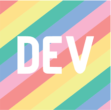

## 
 ✨Matteo | 💻 IT Engineering student | 🌏 Naples, IT 

  
  
  

- 📚 I’m currently learning Python, Javascript
- 👓 Interested in Cyber Security and Software Engineering

## My GitHub Stats 📈

This user has participated in:

 

